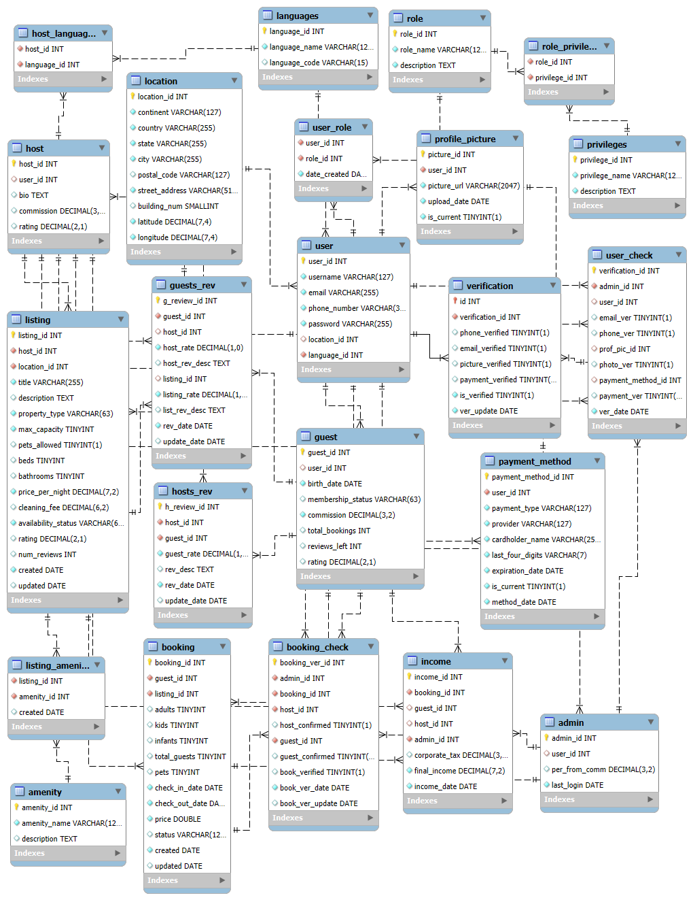

# Conception Phase 
This part of the database design process is called database modelling and represents the most important part of 
the database design. Anything that is overlooked or forgotten in this phase has a negative effect on the implemen
tation later and will lead, in the worst case, to a useless database.

# Summary
In this phase, I have designed a comprehensive database schema based on the "Airbnb" system. The main goal is to create a database structure that represents the "Airbnb" platform and its functionalities, keeping in mind that users have multiple roles, while roles have multiple functions, such as hosts who rent out accommodation, guests who book accommodation, and administrators who verify users and their bookings.
The existing problem revolves around the absence of a structured and well-defined database schema for the “Airbnb” system. The lack of a standardized database makes it difficult to efficiently manage user data, bookings, payments, system revenue, and other essential functions. This can result in errors, security vulnerabilities, and a lack of scalability.

# Solution Approaches
1.	Requirements Specification:
	- Developed a requirements specification document outlining the functionalities associated with each user role.
2.	Entity-Relationship Modeling:
	- Developed an Entity-Relationship Model (ERM) to visually represent the relationships between different entities in the system. Specified cardinality using Chen notation to ensure a clear understanding of the data flow and dependencies within the system. A detailed data dictionary was created to provide explanations of each column in the tables.

# Requirements Specification
The system accommodates various roles with specific functionalities and permissions:
__Guests:__ Individuals who browse and book temporary accommodations. They can search and browse listings based on criteria, book accommodations, initiate payments, manage profiles, view booking history, and leave reviews.
__Hosts:__ Individuals offering accommodations. They can create/manage listings, respond to reservation requests, view income reports, and manage profiles.
__Admins:__ System managers responsible for platform maintenance. They manage and verify user accounts, reset passwords, verify made bookings, configure system settings and generate system-wide reports.
__System:__ Represents automated processes ensuring data integrity, validating user inputs, implementing secure authentication, and calculating revenue.
__Overall Actions:__ Users can select preferred languages, and the system supports multiple languages. Users can upload/manage multimedia content, ensuring proper storage and retrieval.
__Required Data and Functions:__
Guest personal information (name, email, contact details), booking history, language preference data are required for the guest. Host personal information, listing details (location, pricing, availability, amenities), and reservation history data are required for the host. Admin information, user and listing data for monitoring and reporting data are required for the admin. Booking and multimedia content data are required for the system.
__Guest Functions:__ Search for Available Properties Based on Criteria (Location, Date, and Price), View Property Details (Photos, Descriptions, and Reviews), Make a Reservations. Leave Reviews for Properties and Hosts, Manage Their Profile and View Their Booking History.
__Host Functions:__ List Properties and Provide Details (Location, Pricing, Amenities, and Availability), Update Property Details and Manage Availability Calendars. View Booking Requests and Approve/Decline Reservations, Leave Reviews for Guests, Manage Profile Information.
__Admin Functions:__ Monitor and Manage User Accounts, Including Handling Reports and Disputes, Ensure Listings Comply with Platform Policies. Access and Analyze Platform-wide Data for Performance, Manage payments, Update Platform Configurations, Policies, and Security Protocols.
__System Functions:__ Data Integrity Enforcement, Security Management, Multilingual Support, Media Management, Handling Transactions and Calculating Revenue. Providing Guests and Hosts Rate and Review Each Other.
__Overall Functions:__
__Multilingual Support:__ User language Preferences, Language Configuration.
__Media Management:__ Upload and Manage Multimedia Content, Ensure Proper Storage and Retrieval of Media.
__Search and Browse Listings:__ Filter and Sort Listings Based on Criteria.
__Make Reservations:__ Initiate Reservation Process, Provide Check-in and Check-out Dates, Process Payments Securely.
__Create and Manage Listings:__ Add New Listings, Edit or Deactivate Existing Listings, Provide Detailed Listing Information.
__Respond to Reservation Requests:__ View and Respond to Reservation Requests, Confirm or Decline Reservations Based on Availability.
__View Income Reports:__ Access Reports Summarizing Yearly Income from Reservations.
__Leave Reviews:__ Submit Reviews and Ratings for Past Stays Add, Edit, or Delete Employee Records: Manage Employee Information and Records.
__Configure System Settings:__ Manage Global Settings for System Operation.
__Data Integrity Enforcement:__ Enforce Referential Integrity Constraints, Validate and Sanitize User Inputs.
__Security Management:__ Ensure secure data handling, prevent unauthorized access, and manage user authentication.

# ER Model

# Data Dictionary
admin	admin_id(PK)	Unique identifier for an admin.	int
	user_id(FK)	References the user_id in the user table.	int
	per_from_comm	A percentage from an income, an admin is getting paid for a done booking.	decimal (3,2)
	last_login	Date, when an admin was logged last time.	date

amenities	amenity_id(PK)	Unique identifier for an amenity.	int
	amenity_name	Name for an amenity.	varchar (127)
	created	Date of creation.	date

booking	booking_id(PK)	Unique identifier for a booking.	int
	guest_id(FK)	References the guest_id in the guest table.	int
	listing_id(FK)	References the lsiting_id in the listing table.	int
	adults	Number of adults.	tinyint
	kids	Number of kids (2 - 12).	tinyint
	infants	Number of infants (0 - 2).	tinyint
	total_guests	Number of total guests.	tinyint
	pets	Number of pets.	tinyint
	check_it_date	Date of check-in.	date
	check_out_date	Date of check-out.	date
	price	Price of booking.	double
	status	Status of a booking (e.g., “Pending”, “Confirmed”, “Canceled”).	varchar (127)
	created	Date, when the booking was created.	date
	updated	Date, when the booking was updated.	date

booking_check	booking_ver_id(PK)	Unique identifier for a verified booking.	int
	admin_id(FK)	References the admin_id in the admin table.	int
	booking_id(FK)	References the booking_id in the booking table.	int
	host_id(FK)	References the host_id in the host table.	int
	host_confirmed	Has the host confirmed the booking?	bool
	guest_id	References a guest_id in guest table.	int
	guest_confirmed	Has the guest after 24 hours confirmed the booking?	bool
	book_verified	Was booking verified by admin?	bool
	book_ver_date	Date of a booking verification.	date
	book_ver_update	Date of a booking verification update.	date

guest	guest_id(PK)	Unique identifier for a guest.	int
	user_id(FK)	References the user_id in the user table.	int
	birth_date	Date of birth.	date
	membership_status	Status of a guest’s membership (e.g., “Standard”, “Gold”, “Premium”).	varchar (63)
	commission	Commission, that guest pays (depends on his status).	decimal (3,2)
	total_bookings	Number of bookings, that guest has.	int
	reviews_left	Number of reviews, that guest has left.	int
	rating	Rating of a guest.	decimal (2,1)

guests_rev	g_review_id(PK)	Unique identifier for a guest’s review.	int
	guest_id(FK)	References the guest_id in the guest table.	int
	host_id(FK)	References the host_id in the host table.	int
	host_rate	Rating, that guest gave to the host.	decimal (1,0)
	host_rev_desc	Comment on host’s review.	text
	listing_id(FK)	References the lsiting_id in the listing table.	int
	listing_rate	Rating, that guest gave to the listing.	decimal (1,0)
	list_rev_desc	Comment on listing’s review.	text
	rev_date	Date of a review.	date
	update_date	Date of an update of a review.	date

host	host _id(PK)	Unique identifier for a host.	int
	user_id(FK)	References the user_id in the user table.	int
	bio	Description of a host.	text
	commission	Commission, that host pays to Airbnb (It is constant 3%).	decimal (3,2)
	rating	Rating of a host.	decimal (2,1)

host_languages	host_id(FK)	References the host_id in the host table.	int
	language_id(FK)	References the language_id in the languages table.	int

hosts_rev	h_review_id(PK)	Unique identifier for a host’s review.	int
	host_id(FK)	References the host_id in the host table.	int
	guest_id(FK)	References the guest_id in the guest table.	int
	rev_desc	Rating, that host gave to a guest.	decimal (1,0)
	rating	Comment on guest’s review.	text
	rev_date	Date of a review.	date
	update_date	Date of an update of a review.	date

income	income_id(PK)	Unique identifier for an income calculation.	int
	booking_id(FK)	References the booking_id in the booking table.	int
	guest_id(FK)	References the guest_id in the guest table.	int
	host_id(FK)	References the host_id in the host table.	int
	admin_id(FK)	References the admin_id in the admin table.	int
	corporate_tax	Corporate tax (21%), Airbnb pays to US government, since Airbnb’s main office is based in San Francisco.	decimal (3,1)
	final_income	After tax income, Airbnb gets from a successful booking. It is usually counted from guest’s and host’s commissions.	decimal (7,2)
	income_date	Date of an income.	decimal (2,1)

languages	language_id(PK)	Unique identifier for a language.	int
	language_name	Name of language.	varchar (127)
	language_code	International code of a language.	varchar (15)

listing	listing_id(PK)	Unique identifier for a listing.	int
	host_id(FK)	References the host_id in the host table.	int
	location_id (FK)	References the location_id in the location table.	int
	title	Title of a listing.	varchar (255)
	description	Description of a listing.	text
	property_type	Type of a property (e.g., "Apartment", "House", "Villa", “Room”).	varchar (63)
	max_capacity	Number of maximum guests allowed.	tinyint
	beds	Number of beds.	tinyint
	bathrooms	Number of bathrooms.	tinyint
	price_per_night	Price of a listing per night.	decimal (7,2)
	cleaning_fee	Cleaning fee of a listing.	decimal (6,2)
	availability_status	Current availability status (e.g., "Available", "Blocked", "Booked").	varchar (63)
	rating	Rating of a booking.	decimal (2,1)
	created	Date, when the listing was created.	date
	updated	Date, when the listing was updated.	date

listing_amenity	listing_id(FK)	References the lsiting_id in the listing table.	int
	amenity_id(FK)	References the amenity_id in the amenity table.	int
	created	Date, when listing got an amenity.	date

location	location_id(PK)	Unique identifier for a location.	int
	continent	Name of a continent.	varchar (127)
	country	Name of a country.	varchar (255)
	state	Name of a state.	varchar (255)
	city	Name of a city.	varchar (255)
	postal_code	Postal code.	varchar (127)
	building_num	Number of a building.	smallint
	latitude	Latitude of a location.	decimal (7,4)
	longitude	Longitude of a location.	decimal (7,4)

payment_method	payment_method_id(PK)	Unique identifier for a payment method.	int
	user_id(FK)	References the user_id in the user table.	int
	payment_type	Type of payment method (e.g., "Credit Card", "PayPal").	varchar (127)
	provider	Provider (e.g., “Visa”, “MasterCard” etc.).	varchar (127)
	cardholder_name	Cardhoder’s name.	varchar (255)
	last_four_digits	Last four digits of a card.	varchar (7)
	expiration_date	Expiration date of a card.	date
	is_current	Is a payment method up to date?	bool
	method_date	Date, when payment method was added.	date

privileges	privilege_id(PK)	Unique identifier for a privilege.	int
	privilege_name	Name of a privilege.	varchar (127)
	description	Description of a privilege.	text

profile_picture	picture_id_id(PK)	Unique identifier for a profile picture.	int
	user_id(FK)	References the user_id in the user table.	int
	picture_url	URL of a picture.	varchar (2047)
	upload_date	Date, when a profile picture was uploaded	date
	is_current	Is profile picture up to date?	bool

role	role_id(PK)	Unique identifier for a role.	int
	role_name	Name of a role.	varchar (127)
	description	Description of a role.	text

role_privilege	role_id(FK)	References the role_id in the role table.	int
	privilege_id(FK)	References the privilege_id in the privilege table.	int

user	user_id(PK)	Unique identifier for a user.	int
	username	Username of a user.	varchar (127)
	email	Email of a user.	varchar (255)
	phone_number	Phone number of a user.	varchar (31)
	password	Password of a user.	varchar (255)
	location_id(FK)	References the location_id in the location table.	int
	language_id(FK)	References the language_id in the languages table.	int

user_check	verification_id(PK)	Unique identifier for a user verification.	int
	admin_id(FK)	References the admin_id in the admin table.	int
	user_id(FK)	References the user_id in the user table.	int
	email_ver	Has an admin verified the email?	bool
	phone_ver	Has an admin verified the phone number?	bool
	prof_pic_id(FK)	References the picture_id in the profile_picture table.	int
	photo_ver	Has an admin verified the profile picture?	bool
	payment_method_id(FK)	References the payment_method_id in the payment_method table.	int
	payment_ver	Has an admin verified the payment method?	bool
	ver_date	Date of a user verification.	date

user_role	user_id(FK)	References the user_id in the user table.	int
	role_id(FK)	References the role_id in the role table.	int
	date_created	Date when a user created a role.	date

verification	id(PK)	Unique identifier for verification of a user. Also references the user_id in the user table	int
	verification_id (FK)	References the verification_id in the user_check table.	int
	user_id(FK)	References a user_id in user table.	int
	phone_verified	Is phone verified?	bool
	email_verified	Is email verified?	bool
	picture_verified	Is profile picture verified?	bool
	payment_verified	Is payment method verified?	bool
	is_verified	Is user account verified?	bool
	ver_update	Date when the verification data were verified.	date
